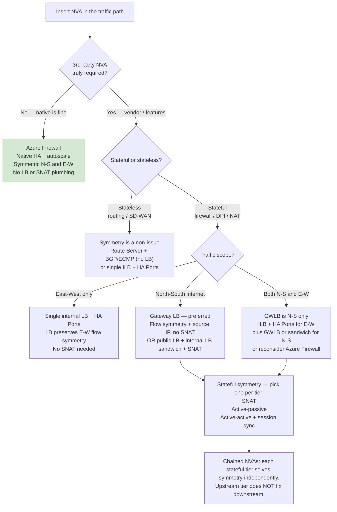

# Highly Available NVAs in Azure

## Document Control
- **Version:** 1.0
- **Created:** 2025-10-11
- **Last updated:** 2026-06-14

> Companion deep-dive to the [Network Design Guide](azure-landing-zone-network-design-guide.md) (*Inspection and Symmetry Requirements*) and the [IP Plan](azure-landing-zone-ip-plan.md). This file explains the *why* and *which pattern*; those define the *standard* and the *exact addressing*. All claims are aligned to current Microsoft Learn guidance (see [References](#references)).

## Purpose

This document describes Microsoft-recommended patterns for deploying highly available network virtual appliances (NVAs) in Azure, with emphasis on traffic symmetry, load balancer choice, and when to use a third-party NVA versus Azure-native security services. It is intended for Azure hub-spoke and transit designs, including east-west inspection, north-south inspection, and chained NVA scenarios.

## Core design principle

The first decision is whether a third-party NVA is required at all. If [Azure Firewall](https://learn.microsoft.com/azure/firewall/overview) satisfies the security and routing requirements, it is usually the simplest and most supportable option because it provides native high availability and removes the need to design load-balancer symmetry, SNAT handling, or appliance state synchronization. If a third-party NVA is required for vendor, feature, or licensing reasons, then the rest of the design depends on whether the appliance is stateful or stateless and which traffic paths it must handle.

## Microsoft guidance on symmetry

Traffic symmetry is primarily an NVA-layer concern, not a "more load balancers" problem. Microsoft documents that load-balancing decisions are made per flow using the [five-tuple](https://learn.microsoft.com/azure/load-balancer/components#high-availability-ports) (source IP, source port, destination IP, destination port, and protocol), and that flow symmetry is only guaranteed in specific architecture patterns; it is not guaranteed across multiple load balancer components or multiple frontend configurations. For stateful appliances, symmetry must be enforced by appliance design such as SNAT, active-passive operation, or session/state synchronization.

## Recommended architecture patterns

Microsoft's [HA NVA guidance](https://learn.microsoft.com/azure/architecture/networking/guide/network-virtual-appliance-high-availability) breaks the common designs into four practical patterns: Load Balancer (internal, or public + internal), Azure Route Server with next-hop IP, Gateway Load Balancer, and dynamic public IP with UDR-based active-passive designs. Each pattern solves a different problem, and none of them is universally correct for every traffic type.

### 1. Internal Load Balancer with HA Ports

Use a single internal Standard Load Balancer with [HA Ports](https://learn.microsoft.com/azure/load-balancer/load-balancer-ha-ports-overview) when the NVA is handling internal transit, such as east-west traffic or forced tunneling inside a hub-spoke design. Microsoft's HA Ports guidance supports this pattern for internal transit use cases, but it is not a universal solution for internet-facing north-south inspection. This makes HA Ports a good fit for a single internal transit point.

### 2. Azure Route Server with next-hop IP

Use [Azure Route Server](https://learn.microsoft.com/azure/route-server/hub-routing-preference) when the appliance is acting as a routing or SD-WAN next hop and the design is primarily stateless or BGP-driven. Route Server's next-hop IP support is designed so Azure can peer with NVAs behind an internal load balancer, and the guidance notes that active-active connectivity can create asymmetric routing while active-passive can preserve symmetry. For a stateful appliance behind Route Server, traffic symmetry still requires SNAT. This pattern is best when you want route-based distribution rather than load-balancer-based steering.

### 3. Gateway Load Balancer

Use [Gateway Load Balancer](https://learn.microsoft.com/azure/load-balancer/gateway-overview) when you need transparent, scalable insertion of a third-party NVA into north-south internet traffic. Microsoft states that Gateway Load Balancer maintains flow stickiness and flow symmetry while preserving the original source IP, which avoids the need for SNAT in the common north-south inspection scenario. This is the preferred pattern when the appliance must sit in the path without forcing you to build the classic sandwich-and-SNAT model. Note that Gateway Load Balancer covers north-south flows and does not support east-west flows.

### 4. Dynamic public IP with UDRs

Use active-passive with dynamic public IP and user-defined routes only when the appliance model or operational constraints require it. Microsoft includes this as a valid HA pattern, but it is generally less elegant and has slower failover characteristics (typically one to two minutes) than the other options. It remains useful when you want a simple symmetric return path and can tolerate standby behavior.

## Load balancer count

The number of load balancers depends on the NVA interface model and traffic scope, not on the number of directions traffic travels. For a single-NIC appliance in a routing-style design, one internal load balancer may be enough. For dual-NIC trust/untrust firewall designs, a separate load-balancing construct is typically used per side, but the correct question is whether the appliance architecture needs two zones, not whether Azure requires one load balancer per direction.

## Traffic-scope guidance

### East-west only

For east-west transit inside the Azure network, a single internal Standard Load Balancer with HA Ports is the common Microsoft pattern. In this design, the internal LB is the traffic entry point into the NVA pair, and symmetry is maintained because both directions of a flow traverse the same load balancer, which selects the same NVA instance for both legs. This is appropriate for internal inspection, spoke-to-spoke routing, and forced tunneling through a hub.

### North-south internet traffic

For internet-facing north-south inspection, Microsoft's preferred pattern is Gateway Load Balancer when a third-party NVA is required. If a classic public-LB-plus-internal-LB sandwich is used instead, stateful appliances typically require SNAT to ensure the return flow reaches the same instance and does not become asymmetric. Microsoft notes that flow symmetry is not guaranteed when placing NVAs between a public and internal load balancer, which is why Gateway Load Balancer is the cleaner design. When the sandwich-and-SNAT model is used, watch for SNAT port exhaustion at scale; Microsoft recommends an [Azure NAT gateway](https://learn.microsoft.com/azure/nat-gateway/nat-overview) with availability-zone support for scalable, resilient egress.

### Both north-south and east-west

If the environment needs both north-south internet inspection and east-west inspection, then a single mechanism is usually not enough. Gateway Load Balancer covers north-south insertion, while a separate internal load balancer with HA Ports is still needed for east-west transit. In many environments, this is the point where Azure Firewall becomes the more supportable option because it simplifies both traffic classes in one platform.

## Stateful versus stateless

Stateless appliances, such as pure routing or SD-WAN forwarding functions, do not require the same symmetry guarantees as firewalls or NAT devices. Stateful appliances must preserve session continuity, so the design must explicitly choose one of the accepted symmetry mechanisms: SNAT, session synchronization, or active-passive operation. If a stateful appliance is chained with another stateful appliance, each tier must solve symmetry independently.

## Chained NVAs

When chaining NVAs, the upstream appliance does not solve symmetry for the downstream appliance. Each stateful tier needs its own symmetry strategy, and the safest way to reason about the design is to treat each hop as an independent forwarding decision (Azure forwards on destination IP against the subnet's effective routes — see [How Azure selects routes](https://learn.microsoft.com/azure/virtual-network/virtual-networks-udr-overview#how-azure-selects-routes-for-traffic-routing)). This is one reason why chained stateful NVAs are harder to operate than a native Azure Firewall design. For the fabric-routed chain cascade (per-segment subnets and per-subnet UDRs), see [IP Plan Section 20](azure-landing-zone-ip-plan.md).

## When Azure Firewall is the better choice

Azure Firewall should be the default option whenever it meets the functional requirement because it avoids the need to design and operate NVA high availability, state sync, SNAT behavior, and multiple load balancer patterns. It is the most natural fit for hub-spoke security, centralized policy enforcement, and many ALZ deployments. Only choose a third-party NVA when there is a clear vendor, feature, or operational requirement that Azure Firewall does not satisfy.

## Decision tree

## Summary table

| Scenario | Recommended pattern | Symmetry mechanism | Notes |
|---|---|---|---|
| Native security is sufficient | Azure Firewall | Native HA and state handling | Simplest ALZ choice |
| Stateless routing / SD-WAN | Route Server or single ILB pattern | Not required in the same way | ECMP and multi-path are acceptable |
| Stateful east-west only | Single internal LB + HA Ports | LB-supported within the pattern | Good for hub-spoke transit |
| Stateful north-south internet | Gateway Load Balancer | Built-in flow symmetry, no SNAT | Preferred Microsoft pattern; N-S only |
| Stateful north-south with classic sandwich | Public LB + internal LB | SNAT or active-passive | More operational overhead |
| Both north-south and east-west | Combine patterns or use Azure Firewall | Per-tier symmetry handling | Do not assume one pattern covers both |

## Best-practice notes

- Prefer Microsoft-native services when they meet the requirement.
- Do not assume HA Ports alone solves every symmetry problem; it preserves symmetry only when both legs of a flow traverse the same internal load balancer.
- Treat NAT behavior, session sync, and active-passive design as appliance properties, not load balancer features.
- Use Gateway Load Balancer for transparent third-party NVA insertion on north-south paths.
- Validate routing, UDR propagation, and peering behavior carefully in hub-spoke deployments.

## Appendix: Design checklist

### Architecture questions

1. Do we truly need a third-party NVA?
2. Is the NVA stateful or stateless?
3. Is the traffic east-west, north-south, or both?
4. Is the appliance single-NIC or dual-NIC?
5. Do we need transparent insertion or route-based steering?
6. Can Azure Firewall satisfy the requirement instead?

### Implementation checks

- Confirm the appliance vendor's Azure reference architecture.
- Confirm whether the appliance supports SNAT, session sync, or active-passive failover.
- Validate the UDR path from spoke to hub and back.
- Confirm whether Gateway Load Balancer is supported by the appliance version.
- Confirm source IP preservation requirements for inspection logs.
- Validate failover behavior under zone and regional failure scenarios.

### Common mistakes

- Assuming a second load balancer automatically fixes asymmetry.
- Using HA Ports as a substitute for state synchronization.
- Chaining multiple stateful appliances without a symmetry plan.
- Using a public/private sandwich when Gateway Load Balancer is available and supported.
- Choosing a third-party NVA when Azure Firewall already satisfies the need.

## References

These are the current Microsoft Learn pages this guide is aligned to:

- [Deploy highly available NVAs](https://learn.microsoft.com/azure/architecture/networking/guide/network-virtual-appliance-high-availability) — architecture patterns and decision guidance (the four HA patterns and their symmetry considerations).
- [High availability ports overview](https://learn.microsoft.com/azure/load-balancer/load-balancer-ha-ports-overview) — internal Standard Load Balancer HA Ports behavior and supported NVA patterns.
- [Azure Load Balancer components](https://learn.microsoft.com/azure/load-balancer/components#high-availability-ports) — per-flow five-tuple load balancing and HA Ports rule definition.
- [Gateway Load Balancer](https://learn.microsoft.com/azure/load-balancer/gateway-overview) — transparent insertion, flow symmetry, and source IP preservation.
- [Azure Load Balancer best practices](https://learn.microsoft.com/azure/load-balancer/load-balancer-best-practices) — recommendation to use Gateway Load Balancer for north-south NVAs over a dual-LB setup.
- [Routing preference with Azure Route Server](https://learn.microsoft.com/azure/route-server/hub-routing-preference) and [Azure Route Server FAQ](https://learn.microsoft.com/azure/route-server/route-server-faq) — route-based integration with NVAs and symmetry caveats.
- [What is Azure Firewall?](https://learn.microsoft.com/azure/firewall/overview) — native HA, autoscale, and stateful inspection.
- [Design a secure hub-spoke network](https://learn.microsoft.com/azure/networking/cross-service-scenarios/design-secure-hub-spoke-network) — reference topology for transit and inspection.
- [How Azure selects routes for traffic routing](https://learn.microsoft.com/azure/virtual-network/virtual-networks-udr-overview#how-azure-selects-routes-for-traffic-routing) — longest-prefix-match and the User > BGP > System priority that governs chained-NVA forwarding.

## Change Log

| Version | Date | Notes |
|---|---|---|
| 1.0 | 2026-06-14 | Initial release. Documents the four Microsoft HA NVA patterns, the native-vs-third-party decision, appliance-layer symmetry mechanisms (SNAT / active-passive / session sync), traffic-scope guidance (E-W, N-S, both), chained-NVA reasoning, decision tree, and an implementation checklist. Verified against live Microsoft Learn. Aligns with the [Network Design Guide](azure-landing-zone-network-design-guide.md) (*Inspection and Symmetry Requirements*) and the [IP Plan](azure-landing-zone-ip-plan.md) (NVA & load-balancer configuration and group chains). |
